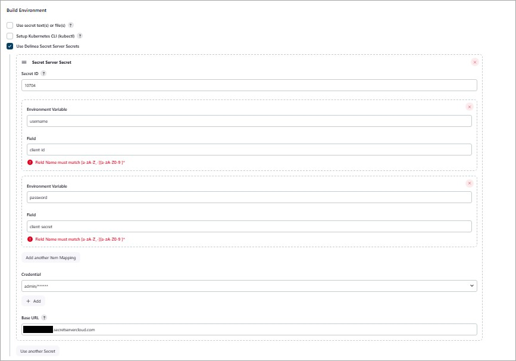

# Delinea Secret Server Jenkins Plugin

The **Delinea Secret Server Jenkins Plugin** allows you to access and reference your Secret Server secrets for use in Jenkins builds.

For detailed information, refer to the [Delinea documentation](https://docs.delinea.com/online-help/integrations/jenkins/configure-jenkins.htm)

## Overview

The integration offers two methods for fetching Secret Server secrets into Jenkins.

### Fetching Secret Server secrets through a pipeline

You can retrieve Secret Server secrets into your build environment through a dedicated pipeline, thus making them available in your Jenkins builds. The build environment configuration includes the ID of the secret to fetch and the URL of your Secret Server.

This method is a good choice if you want to integrate fetched secrets into your build environment for different uses in Jenkins builds.

### Directly accessing and referencing Secret Server secrets

You can directly retrieve secrets into a configuration called **credential resolver** and store the fetched credentials either in the Jenkins global credentials store or in a specific folder, limiting access to the folder to only certain users.

In addition to retrieving the standard **username** and **password** fields into the credential resolver, you can also fetch and store custom secret fields, for example, **client id** and **client secret**.

This method is particularly useful if you want to be able to reference the stored secret values wherever you’re required to provide a username and password in Jenkins.
